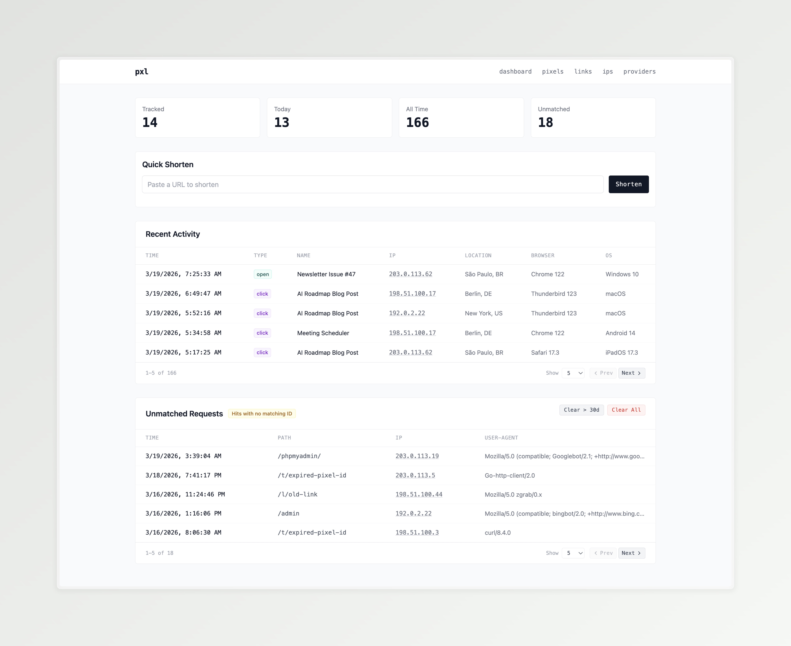

# pxl



Self-hosted tracking for emails and links. Create tracking pixels, shorten URLs, and get notified when someone opens an email or clicks a link — with full IP geolocation, browser, and device info.

Runs as a single Docker container with two HTTP servers:

| Server | Default Port | Purpose |
|---|---|---|
| Management UI | 3000 | Dashboard, pixels, links, IP log, providers |
| Tracker | 3001 | Serves tracking pixels and link redirects (public-facing) |

## Quick Start

```bash
cp .env.example .env
# edit .env — set PXL_BASE_URL to your public tracker URL
docker compose up -d
```

Management UI at `http://localhost:3000`.

## Configuration

All config is via environment variables (or `.env` file):

| Variable | Default | Description |
|---|---|---|
| `PXL_DATA_DIR` | `./data` | SQLite database directory |
| `PXL_MGMT_PORT` | `3000` | Management UI port |
| `PXL_TRACKER_PORT` | `3001` | Tracker port |
| `PXL_BASE_URL` | **required** | Public URL of the tracker (used to generate pixel/link URLs) |

## Features

- **Tracking pixels** — 1x1 transparent PNGs that log opens with IP, user agent, and geolocation
- **Link shortener** — redirect URLs that track every click
- **IP geolocation** — automatic country/city lookup via ip-api.com
- **Notifications** — get alerts via Telegram, Discord, Slack, ntfy, or generic webhooks
- **Unmatched request log** — see bots and scanners hitting invalid paths
- **IP muting** — suppress notifications from known IPs (e.g. your own)

## Notification Providers

Telegram, ntfy, Discord, Slack, and generic webhook. Configure them in the management UI — all just `fetch()` calls, no external libraries.

## Stack

Bun, Hono, Drizzle ORM, SQLite, HTMX, Tailwind CSS (CDN).
